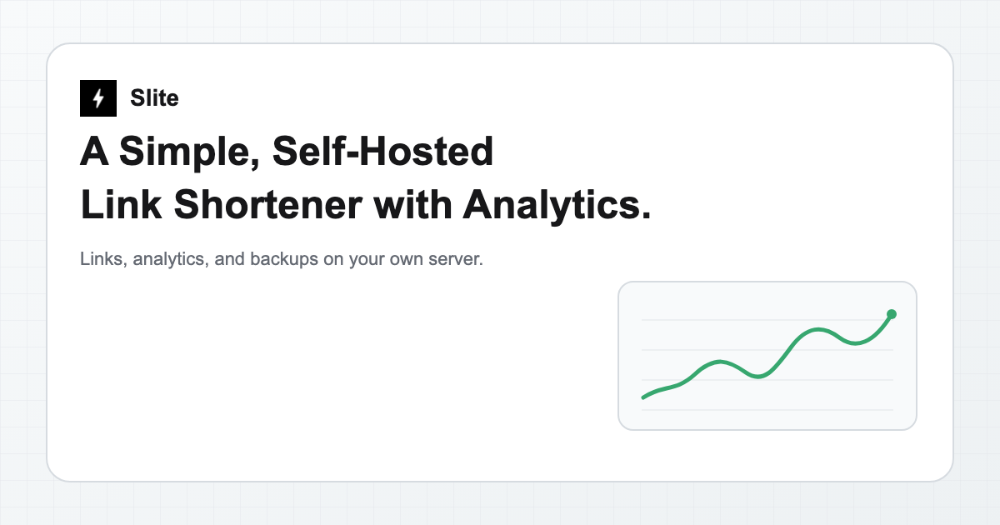

# ⚡ Slite

**A Simple / Speedy / Secure Link Shortener with Analytics, 100% self-hosted.**

[Documentation](docs/index.md) · [Docker deployment](docs/deployment/docker.md) · [API Reference](docs/api/index.md)




---

## ✨ Features

- **🔗 URL Shortening:** Compress your URLs to their minimal length.
- **📈 Analytics:** Monitor link analytics and gather insightful statistics.
- **🏠 Self-Hosted:** Run one Node.js process with Docker or Compose on your own server, with no cloud account.
- **🎨 Customizable Slug:** Support personalized slugs, UTM parameters, and optional case-sensitive slug matching through configuration.
- **🪄 AI Assistance:** Optionally use an OpenAI-compatible provider to generate slugs and OpenGraph metadata.
- **⏰ Link Control:** Set expirations, passwords, and unsafe-link warning pages.
- **📱 Smart Routing:** Redirect visitors by device or country.
- **🖼️ Social Preview:** Customize social previews with titles, descriptions, and images.
- **📊 Near-real-time Analytics:** Display a live 3D globe and event logs using 10-second analytics polling and client-side replay, not SSE or WebSocket.
- **🔲 QR Code:** Generate QR codes for your short links.
- **📦 Import/Export:** Transfer links via JSON and export access analytics via CSV.
- **🌍 Multi-language:** Full i18n support for dashboard and redirect pages.

> [!TIP]
> **Who is Slite for?**
>
> Slite focuses on **individuals and small teams** who want a simple, self-hosted shortener on their own server.
>
> For professional / business needs (managed service, multi-user, SLA, and more), use **[S.EE](https://slite.cool/see)**.

## 🔀 Sibling versions

Slite v0 and [Sink](https://github.com/miantiao-me/Sink) are sibling versions of the same link-management and analytics project. Sink runs on Cloudflare's serverless platform, while Slite runs as a local Node.js/Docker process. They keep features, API contracts, and file organization compatible with each other wherever practical. Neither version is a legacy branch, and Slite is not a fork replacement for Sink.

## 🧱 Technologies Used

- **Framework**: [Nuxt 4](https://nuxt.com/) (client-only) served by a [Nitro](https://nitro.build/) Node.js server
- **Runtime**: Node.js 24 or newer, one process per local data directory
- **Database**: SQLite through Node's built-in `node:sqlite` is the authoritative link store; an [unstorage](https://unstorage.unjs.io/) memory cache is rebuildable and never authoritative
- **ORM**: [Drizzle ORM](https://orm.drizzle.team/)
- **Analytics Engine**: Local [DuckDB](https://duckdb.org/) at `/data/analytics.duckdb`
- **Object Storage**: [unstorage](https://unstorage.unjs.io/) filesystem driver for uploaded images (`/data/files/images`) and link backups (`/data/backups`)
- **GeoIP**: [DB-IP](https://db-ip.com) City Lite (CC BY 4.0), bundled in release images
- **AI**: Optional [xsai](https://github.com/moeru-ai/xsai) against an OpenAI-compatible provider
- **UI Components**: [shadcn-vue](https://www.shadcn-vue.com/)
- **Styling**: [Tailwind CSS](https://tailwindcss.com/)
- **Deployment**: [Docker](https://www.docker.com/) and Compose

## 🚗 Roadmap [WIP]

We welcome your contributions and PRs.

- [x] Browser Extension - [Sink Tool](https://github.com/zhuzhuyule/sink-extension)
- [x] Chrome Extension - [Sink Quick Shorten](https://chromewebstore.google.com/detail/sink-quick-shorten/emlojomjpenjgkaphajcokijobpkejih)
- [x] Raycast Extension - [Raycast-Sink](https://github.com/foru17/raycast-sink)
- [x] Apple Shortcuts - [Sink Shortcuts](https://s.search1api.com/sink001)
- [x] iOS App - [Sink](https://apps.apple.com/app/id6745417598)
- [x] Enhanced Link Management (with SQLite)
- [x] Analytics Enhancements (Multi-link filtering)
- [x] Dashboard Performance Optimization (Infinite loading)
- [x] API, migration, backup, and redirect tests

## 🏗️ Deployment

The released image is published to GHCR. Docker Engine with Compose v2 is all you need:

```sh
git clone https://github.com/miantiao-me/Slite.git
cd Slite
cp .env.example .env
docker compose up -d
```

The supplied Compose service pulls `ghcr.io/miantiao-me/slite:latest`, publishes host port `5483`, and mounts the named volume `slite-data` at `/data`. Open `http://localhost:5483/dashboard` and sign in with `NUXT_SITE_TOKEN`, which must be at least 8 characters. To build the image from this source tree instead of pulling it, run `docker compose up -d --build`.

The [`Container` workflow](.github/workflows/docker.yml) builds and publishes the image on pushes to the default `master` branch, on tag pushes, and on manual dispatch runs. The default branch publishes `latest` without requiring a tag, while a tag publishes only its own image tag.

> [!IMPORTANT]
> Without `NUXT_SITE_TOKEN`, Slite still serves public short links, but it generates a random token that exists only in that process. The dashboard and API cannot be authenticated, the value is never logged or written to disk, and it changes on every restart. Configure a token and restart to administer the instance.

For public deployments, put a TLS reverse proxy in front of Slite and keep `NUXT_TRUST_PROXY=false` unless the application is reachable only through that proxy and it overwrites forwarded headers. See [Docker and Compose](docs/deployment/docker.md) and [Upgrading Slite](docs/deployment/upgrading.md).

## ⚒️ Configuration

Copy `.env.example` to `.env` and restart the process after changing runtime configuration. Key variables:

| Variable                   | Default | Purpose                                                                                      |
| -------------------------- | ------- | -------------------------------------------------------------------------------------------- |
| `NUXT_SITE_TOKEN`          | empty   | Dashboard/API token; at least 8 characters when set; unset keeps administration inaccessible |
| `NUXT_DATA_DIR`            | `/data` | Writable local persistent directory                                                          |
| `NUXT_TRUST_PROXY`         | `false` | Trust forwarded client information only behind a controlled proxy                            |
| `NUXT_GEOIP_PATH`          | empty   | Optional MMDB override with priority over the bundled database                               |
| `NUXT_DISABLE_AUTO_BACKUP` | `false` | Set to `true` to stop the daily automatic link backup                                        |
| `NUXT_AI_BASE_URL`         | empty   | OpenAI-compatible API base URL; required with the model to enable AI                         |
| `NUXT_AI_MODEL`            | empty   | Model identifier required with the base URL to enable AI                                     |
| `NUXT_AI_API_KEY`          | empty   | AI provider key; may stay empty when the provider does not require one                       |

The full reference, including webhook and redirect options, lives in [Configuration](docs/configuration/index.md).

### GeoIP

Release images bundle the monthly **DB-IP City Lite** database. The upstream data is published by [DB-IP](https://db-ip.com) under this attribution:

> Contains the DB-IP City Lite database (https://db-ip.com). DB-IP City Lite is licensed under the [Creative Commons Attribution 4.0 International License](https://creativecommons.org/licenses/by/4.0/).

The image ships the same notice at `/app/geoip/ATTRIBUTION.txt`. City Lite provides country, region, city, and coordinates, and **no time-zone data**, so Slite never reports a time zone from it.

A readable database is resolved in this order: `NUXT_GEOIP_PATH`, `/data/geoip.mmdb`, `/data/dbip-city-lite.mmdb`, then the bundled image database. Lookups fail open: without a database, geographic fields stay empty and the rest of the application keeps working.

### Optional AI

AI is disabled until both `NUXT_AI_BASE_URL` and `NUXT_AI_MODEL` are set; until then the AI routes return `501` without an outbound request. Requests send only the URL you provide, never page content or secrets. See [Optional AI](docs/features/ai.md).

## 💾 Data and Backup

Mount a **local persistent volume** at `/data` and run only one process against it. Do not use clustered workers, multiple replicas, or a shared network filesystem.

| Path                     | Contents                                                    |
| ------------------------ | ----------------------------------------------------------- |
| `/data/slite.sqlite`     | Links and application state; the single authoritative store |
| `/data/analytics.duckdb` | Analytics events and queries                                |
| `/data/files/images`     | Uploaded images through the unstorage filesystem driver     |
| `/data/backups`          | Link-export backups through the unstorage filesystem driver |

The link cache uses the unstorage memory driver: it lives only in the running process, is repopulated from SQLite on demand, and is never a second source of truth. Committed link writes invalidate cached entries, and cache failures fall back to SQLite. There is nothing to back up or restore for caching.

Automatic link backups run daily and retain the latest 30 automatic backups; manual backups are never removed by automatic retention. Set `NUXT_DISABLE_AUTO_BACKUP=true` to disable the schedule.

Link backups are **JSON exports, not complete snapshots**: they exclude the link cache, DuckDB analytics, and uploaded images. For a complete backup, stop the container (`docker compose stop`), copy the **entire `/data` directory**, including `slite.sqlite`, store configuration and secrets separately, then start it again (`docker compose start`). See [Backups and Restore](docs/features/backups.md).

## 🔌 API

Each instance serves its own OpenAPI reference. The documentation pages are anonymously readable, while API requests require the site token:

- `/_docs/openapi.json`: OpenAPI schema
- `/_docs/scalar`: interactive reference
- `/_docs/swagger`: Swagger UI

```http
Authorization: Bearer YOUR_SITE_TOKEN
```

See [REST API](docs/api/index.md) for route groups and [Import and Export](docs/features/import-export.md) for moving records.

## 🤖 AI Skills

Install the Slite skill for AI coding assistants:

```bash
npx skills add miantiao-me/Slite
```

The skill source is [`skills/slite/SKILL.md`](skills/slite/SKILL.md).

## 🧰 MCP

Slite does not ship a native MCP server, but its OpenAPI documentation works with an OpenAPI-to-MCP proxy.

> Replace `OPENAPI_SPEC_URL` with your own instance URL. `API_KEY` uses the same value as `NUXT_SITE_TOKEN`.

```json
{
  "mcpServers": {
    "slite": {
      "command": "uvx",
      "args": ["mcp-openapi-proxy"],
      "env": {
        "OPENAPI_SPEC_URL": "https://your-domain/_docs/openapi.json",
        "API_KEY": "YOUR_SITE_TOKEN",
        "TOOL_WHITELIST": "/api/link"
      }
    }
  }
}
```

## 🙋🏻 FAQs

[Troubleshooting](docs/faqs.md)

## 💻 Development

Requires **Node.js 24 or newer** and **pnpm 11.11.0**.

```sh
pnpm install
pnpm dev
```

The development server listens on port `5483` and stores runtime data in `./data` (set `NUXT_DATA_DIR` to override). Set `NUXT_SITE_TOKEN` in your environment or local `.env`, and never point development and production processes at the same data directory.

SQLite uses Node's built-in `node:sqlite` module; DuckDB is a native module. Install dependencies for the target Node.js runtime, operating system, and architecture; do not copy host `node_modules` into Docker images.

```sh
pnpm build
pnpm lint
pnpm types:check
pnpm test --run
pnpm build:docs
```

## 📚 Documentation

- [Getting started](docs/guide/getting-started.md)
- [Architecture](docs/guide/architecture.md)
- [Docker deployment](docs/deployment/docker.md)
- [Configuration](docs/configuration/index.md)
- [Backups and restore](docs/features/backups.md)
- [Import and export](docs/features/import-export.md)
- [REST API](docs/api/index.md)

Build the documentation with `pnpm build:docs`, or serve it locally with `pnpm dev:docs`.

## 🤝 Contributing

Contributions are welcome through issues and pull requests at [miantiao-me/Slite](https://github.com/miantiao-me/Slite). Before opening a pull request, run:

```sh
pnpm lint
pnpm types:check
pnpm test --run
```

All participants are expected to follow the [Code of Conduct](CODE_OF_CONDUCT.md).

## 💖 Credits

1. [**Sink**](https://github.com/miantiao-me/Sink) — the Cloudflare-based sibling version of Slite.
2. [**Nuxt**](https://nuxt.com/) and [**Nitro**](https://nitro.build/)
3. [**Drizzle ORM**](https://orm.drizzle.team/)
4. [**DuckDB**](https://duckdb.org/), [**unstorage**](https://unstorage.unjs.io/), and Node.js `node:sqlite`
5. [**DB-IP**](https://db-ip.com/) for the City Lite database
6. [**shadcn-vue**](https://www.shadcn-vue.com/), [**Tailwind CSS**](https://tailwindcss.com/), and [**Reka UI**](https://reka-ui.com/)
7. [**xsai**](https://github.com/moeru-ai/xsai) for optional AI integration

## 📄 License

[AGPL-3.0-only](LICENSE) © [miantiao-me](https://github.com/miantiao-me)

## ☕ Sponsor

1. [Follow Me on X (Twitter)](https://404.li/x).
2. [Become a sponsor on GitHub](https://github.com/sponsors/miantiao-me).
